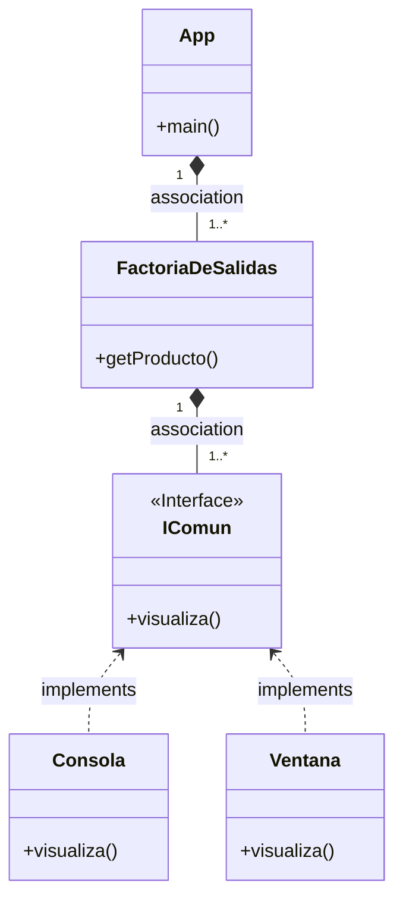

# Patrón Factory

Uso de Factoria muy sencillo

Diagrama de clases:

```mermaid
classDiagram
      IComun <.. Consola : implements
      IComun <.. Ventana : implements
      class IComun{ +visualiza()}
      <<Interface>> IComun
      App "1" *-- "1..*" FactoriaDeSalidas : association
      class App{
          +main()
      }
      class FactoriaDeSalidas{
          +getProducto()
      }
      FactoriaDeSalidas "1" *-- "1..*" IComun : association
      class Consola {+visualiza()}
      class Ventana {+visualiza()} 
      
```